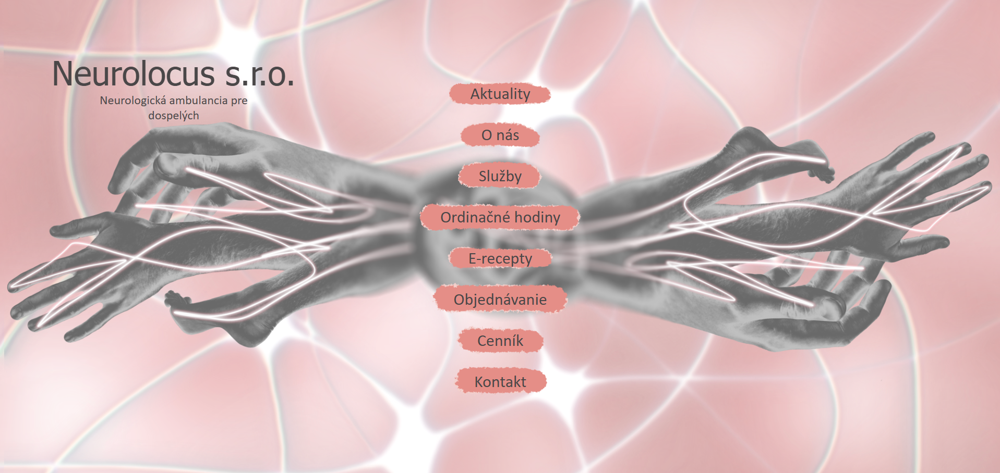

# Neurolocus s.r.o. – Neurologická ambulancia pre dospelých

 
## Overview
Neurolocus s.r.o. is a website of a neurological outpatient clinic for adults. The project contains information pages about services, price list, current announcements and contacts.

## Features
- **Responsive Design**: Works seamlessly on all device sizes
- **Animated Elements**: Scroll-triggered animations for engaging UX
- **Modern UI**: Dark theme with yellow accents for visual impact

## Technologies Used
- **Frontend**: HTML5, CSS3, JavaScript
- **CSS Frameworks**: Custom CSS with CSS variables
- **Fonts**: Google Fonts
- **Animations**: Custom JavaScript animations

